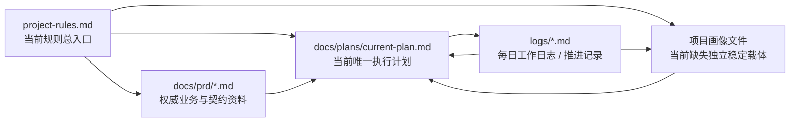

# Global Files Architecture

## 1. 目的

本文件用于从整体上说明 `project-manager-suite` 的全局文件体系如何工作。

它解决两个问题：

1. `ai-project-manager` 处理用户请求时，为什么要先经过全局文件体系
2. 3 类全局文件与 1 类状态回写能力在整个路由链路中分别承担什么作用

本文件是结构总览，不替代以下细节文档：

- `skills/ai-project-manager/references/global-files-protocol.md`
- `skills/ai-project-manager/references/runtime.md`
- `skills/ai-project-manager/references/routing.md`
- `docs/design/project-progression-workflow.md`
- `skills/ai-project-manager/assets/global-files/README.md`

---

## 2. 总体设计原则

这套设计遵循以下原则：

- 先服务产品目标，再定义文件结构
- 先识别全局文件，再判断阶段
- 先补最小载体，再推进下一步
- 先定义文件角色，再定义字段来源
- 主入口先承担路由，不提前承担全部执行细节
- skill 可以逐步补齐，但都必须挂在统一全局文件骨架上
- 对外遵循渐进式披露，只暴露当前轮必须知道的内容

### 2.1 为什么全局文件体系必须围绕产品目标设计

`project-manager-suite` 的全局文件体系不是中性的“项目文档模板集合”，而是产品骨架的一部分。

原因是这套产品的目标不是单纯整理文档，而是：

- 帮业务方把想法整理清楚
- 让“项目经理模型”推动项目持续往前走
- 让开源版具备最小可用闭环
- 让增强版仍保留核心竞争力
- 让这套能力在不同 AI IDE 中仍然可复用、可移植

因此，全局文件体系必须同时服务以下 5 个产品要求：

1. 目标用户可用
   - 目标用户是不懂完整研发流程的业务方
   - 所以文件必须少而关键，不能按成熟研发组织的重文档体系设计

2. 项目可持续推进
   - 产品卖点不是一次性需求整理，而是持续推进能力
   - 所以必须有项目画像、执行计划、状态回写，而不只是需求说明

3. 主入口可稳定路由
   - `ai-project-manager` 要依赖这些文件判断阶段、缺口和下一步
   - 所以文件字段必须服务“读 -> 判 -> 路由 -> 回写”的链路

4. 开源 / 增强版可分层
   - 公开版文件要能支撑基础闭环
   - 增强判断逻辑不能直接塞进公开文件模板里

5. 跨工具可复用、可移植
   - 关键能力要沉淀在文件、模板、协议和角色模型中
   - 不应依赖某个 AI IDE 的私有运行机制才能工作

一句话说：

**这套全局文件体系存在的原因，不是因为项目管理理论上应该有这些文件，而是因为产品目标要求主入口必须有一套最小、稳定、可持续的路由骨架。**

### 2.2 为什么架构层还要定义字段来源

设计演进继续收敛后，当前模型已经不再只回答“3 类全局文件与状态回写能力分别负责什么”，还要回答“这些文件里的字段应该由谁提供”。

如果只定义文件角色，而不定义字段来源，就会继续出现：

- 用户确认过的项目事实被后续运行判断静默覆盖
- 本可由系统推断的信息被反复转嫁给用户
- 主入口当轮判断结果混入长期事实，导致画像、计划、状态边界继续漂移

因此，当前架构需要同时使用两层约束：

1. 文件角色
   - 解决“信息放在哪个文件里”
2. 字段来源
   - 解决“这些信息默认由谁提供”

统一的字段来源分类是：

- `用户确认`
- `系统推断`
- `主入口判断回写`

它们分别承担：

- `用户确认`：项目事实、业务目标、必须由用户拍板的信息
- `系统推断`：入口识别、身份识别、已有资产和可从仓库与权威文件映射出的信息
- `主入口判断回写`：阶段判断、当前轮交付物、执行主体、待确认项等运行期结论

一句话说：

**3 类全局文件定义“信息放在哪”，状态回写能力定义“最近发生了什么如何沉淀”，字段来源三分类定义“这些信息由谁提供”。**

---

## 3. 主链路架构图

```mermaid
flowchart TD
    U[用户请求 / 现有材料] --> A[ai-project-manager 主入口]

    A --> B{识别宿主项目是否已有\n3 类全局文件与状态回写入口}
    B --> R1[全局规则文件\nproject-rules.md / 现有规则入口]
    B --> P1[项目画像文件\nproject-profile.md]
    B --> E1[当前执行计划文件\nexecution-plan.md]
    B --> S1[状态回写入口\nproject-devlog / logs]

    R1 --> C[读取最小必要上下文]
    P1 --> C
    E1 --> C
    S1 --> C

    C --> D{关键上下文是否缺失}
    D -- 是 --> I[极简访谈\n只补用户确认字段]
    D -- 否 --> J[直接进入阶段判断]

    I --> K[补最小文件载体\n只补当前真正缺的文件]
    K --> P2[更新项目画像\n补用户确认字段/系统推断字段]
    K --> E2[必要时补最小执行计划]
    K --> S2[必要时补最小状态回写]
    K --> R2[必要时补最小规则入口]

    P2 --> J
    E2 --> J
    S2 --> J
    R2 --> J

    J{当前阶段判断}
    J --> S0B[S0 需求调研]
    J --> S1B[S1 业务需求文档]
    J --> S2B[S2 页面构建与完整版 PRD]
    J --> S3B[S3 任务拆解与开发计划]
    J --> S4B[S4 开发执行]
    J --> S5B[S5 测试用例生成]
    J --> S6B[S6 测试执行]
    J --> S7B[S7 人工点检准备]
    J --> S8B[S8 点检结果回写与收口]

    S0B --> O
    S1B --> O
    S2B --> O
    S3B --> O
    S4B --> O
    S5B --> O
    S6B --> O
    S7B --> O
    S8B --> O[输出当前轮最小交付物]

    O --> L{是否必须进入子 skill}
    L -- 否 --> W[停留在主入口继续推进]
    L -- 是 --> M[按需路由到子 skill\n(或者随阶段唤起全局伴随能力)]

    M --> RS[requirements-starter\n需求整理]
    M --> UX[ui-ux-pro-max\n页面原型]
    M --> PW[prd-writer\n完整版 PRD]
    M --> DP[delivery-planner\n任务拆解]
    M --> EE[engineering-executor\n开发执行]
    M --> TC[prd-test-case-generator\n测试用例]
    M --> TA[test-and-acceptance\n测试验收与收口]
    M --> DL[project-devlog\n状态回写]

    W --> X[按职责回写全局文件]
    RS --> X
    UX --> X
    PW --> X
    DP --> X
    EE --> X
    TC --> X
    TA --> X
    DL --> X

    X --> R3[规则变化 -> 回写全局规则文件]
    X --> P3[项目快照变化\n用户确认事实更新/系统入口补齐/\n主入口判断结果 -> 回写项目画像]
    X --> E3[当前任务变化 -> 回写执行计划]
    X --> S3[本轮结果 -> 回写日志载体]
```

---

## 4. 三类全局文件与状态回写能力关系图


---

## 5. 三类全局文件与状态回写能力的职责定位

这里不仅定义“每类文件回答什么问题”，也补充定义“这类文件默认以哪种字段来源为主”。

### 5.1 全局规则文件

回答的问题：

- 项目怎么运行

主要承载：

- 长期规则
- 规则入口与引用约定
- 协作原则
- 交付底线

默认字段来源：

- 以 `系统推断` 为主
- 少量 `用户确认` 只用于长期协作边界和已经拍板的长期约束
- `主入口判断回写` 只允许在“本轮结论已升级为长期规则”时沉淀进来

不承载：

- 当前项目负责人
- 当前执行主体 / 审核主体
- 当前阶段任务
- 本轮推进结果

### 5.2 项目画像文件

回答的问题：

- 项目当前是什么

主要承载：

- 项目目标
- 目标用户
- 第一版范围
- 当前阶段
- 当前最适合进入的阶段
- 当前轮应输出的交付物
- 协作模式
- 当前业务确认主体
- 当前执行主体 / 审核主体
- 项目入口与识别信息
- 待确认项

默认字段来源：

- `用户确认`：项目名称、项目一句话目标、目标用户、主要问题、第一版核心目标、协作模式等项目事实
- `系统推断`：规则入口、计划入口、状态入口、PRD 入口、身份识别方式、已有资产等识别结果
- `主入口判断回写`：当前阶段、当前最适合进入的阶段、当前轮应输出的交付物、当前任务执行主体 / 审核主体、待确认项等运行期结论

不承载：

- 长期规则
- 详细任务清单
- 完整日志

### 5.3 当前执行计划文件

回答的问题：

- 现在做什么

主要承载：

- 当前任务
- 下一步动作
- 完成标准
- 前置依赖

默认字段来源：

- 以 `主入口判断回写` 为主
- `系统推断` 可以承接前置依赖、资料入口和可从现有计划映射出的上下文
- 不应把需要用户拍板的项目基础事实继续堆进计划文件

不承载：

- 长期规则
- 项目基础画像
- 完整过程记录

### 5.4 状态回写能力

回答的问题：

- 最近发生了什么

主要承载：

- 本轮动作
- 本轮产出
- 风险与阻塞
- 待确认项
- 下一步建议

默认字段来源：

- 以 `主入口判断回写` 为主
- 少量 `系统推断` 用于时间戳、关联阶段、执行主体等运行元信息
- 不应让 `用户确认` 成为状态文件主体，因为状态文件回答的是“本轮发生了什么”

不承载：

- 长期规则
- 全量任务计划

---

## 6. 主入口在其中的角色

`ai-project-manager` 的角色不是“大一统执行器”，而是：

- 全局文件识别入口
- 最小上下文补齐入口
- 阶段判断入口
- 路由入口
- 回写入口

也就是说，主入口首先是一个“围绕全局文件体系运行的项目路由器”。

---

## 7. 渐进式披露如何落到这套设计

在这套架构里，渐进式披露不是一个口号，而是具体约束：

- 不先展开完整 skill 树
- 不先生成整套完整文档
- 不先暴露全部阶段细节
- 只补当前轮推进必须依赖的文件和信息
- 只向用户暴露“当前下一步”

因此，整体工作顺序被压缩为：

1. 识别已有文件
2. 读取最小必要上下文
3. 补最小缺口
4. 判断阶段
5. 再决定是否调用子 skill

---

## 8. 宿主项目映射样本

这一节用于说明：

宿主项目中的现有文件，如何映射到 `project-manager-suite` 定义的 3 类全局文件与 1 类状态回写能力角色。

这一节不是抽象模型，而是：

- 宿主项目现状映射
- 宿主项目缺口判断
- 后续将宿主项目经验抽象成可复用套件时的落点参考

### 8.1 宿主项目映射总览



### 8.2 3 类全局文件 + 1 类状态回写能力角色映射

#### 8.2.1 全局规则文件

对应角色：

- 项目怎么运行
- 长期规则是什么
- 文档和权威源入口是什么

宿主项目映射：

- `project-rules.md`

判断：

- 这是宿主项目最明确、最稳定的规则总入口
- 已经承担“项目全局规则文件”的职责

支撑证据：

- 明确规定 `docs/` 是权威规则源
- 明确给出项目结构、术语、架构原则、技术栈约定
- 明确给出关键文档入口、团队分工、每日启动规则、执行计划入口

结论：

- 宿主项目的全局规则文件角色已经存在，且承载较完整

#### 8.2.2 项目画像文件

对应角色：

- 项目当前是什么
- 当前阶段、第一版范围、协作模式、关键待确认项是什么

宿主项目映射：

- 当前没有独立、稳定、单一职责的项目画像文件

现状承载分散在：

- `project-rules.md` 中的项目背景、团队分工、边界约束
- `docs/plans/current-plan.md` 中的阶段、目标、差距基线
- `docs/prd/` 中的业务目标和范围
- `logs/` 中的阶段性结论与待跟进事项

判断：

- 宿主项目不是没有画像信息
- 而是画像信息分散在规则、计划、PRD、日志四处
- 且这些信息的来源类型也混在一起，用户确认事实、系统可识别入口、主入口当轮判断没有稳定边界
- 这会导致主入口很难快速建立“当前项目快照”

结论：

- 项目画像文件是宿主项目最明显的体系缺口
- 字段来源三分类也是宿主项目最需要补上的治理口径
- 也是最适合优先抽象成套件默认能力的一类文件

#### 8.2.3 当前执行计划文件

对应角色：

- 当前阶段做什么
- 当前任务、前置关系、完成标准是什么

宿主项目映射：

- `docs/plans/current-plan.md`

判断：

- 该文件已经明确声明自己是“当前唯一执行计划”
- 已经承担当前执行计划文件的角色

支撑证据：

- 包含差距基线、阶段划分、任务、前置、完成标准
- 在 `docs/ai-rules.md` 中被指定为唯一执行文档
- 每日启动规则要求开始任务前必须先读取该文件

结论：

- 宿主项目的执行计划文件角色已经存在，且非常明确

#### 8.2.4 状态回写能力

对应角色：

- 最近发生了什么
- 本轮动作、产出、风险、待跟进项是什么

宿主项目映射：

- `logs/`
- 以及部分分散在 `docs/retrospectives/` 和相关测试/缺陷文档中的状态沉淀

当前最稳定入口：

- `logs/*_worklog*.md`

判断：

- 宿主项目已经有明显的状态回写习惯
- 但载体是目录级，而不是单一文件级
- 这不影响它承担“状态回写能力默认载体”角色

支撑证据：

- 每日日志中已记录执行概要、变更总览、复盘、待跟进事项
- `docs/ai-rules.md` 要求每日启动时读取最近一日日志

结论：

- 宿主项目的状态回写角色已经存在
- 但未来抽象到套件时，需要允许“单文件或目录”两种承载形式

### 8.3 宿主项目缺口判断

基于现状映射，宿主项目对 3 类全局文件与 1 类状态回写能力的覆盖情况如下：

| 角色 | 当前状态 | 当前承载 |
|---|---|---|
| 全局规则文件 | 已存在 | `project-rules.md` |
| 项目画像文件 | 缺失独立载体 | 信息分散在规则 / 计划 / PRD / 日志 |
| 当前执行计划文件 | 已存在 | `docs/plans/current-plan.md` |
| 状态回写能力（默认日志载体） | 已存在 | `logs/` |

一句话判断：

**宿主项目不是缺整套体系，而是同时缺一个稳定独立的“项目画像文件”，以及一套稳定的字段来源边界。**

### 8.4 为什么项目画像是关键缺口

因为在宿主项目里：

- 规则文件解决的是“怎么运行”
- 执行计划解决的是“当前做什么”
- 日志解决的是“最近发生了什么”

但仍缺一个文件专门回答：

- 这个项目当前到底是什么状态
- 第一版范围是什么
- 当前阶段是什么
- 谁是执行主体 / 审核主体
- 还有哪些关键待确认项

没有这个中间层，主入口就只能在规则、计划、PRD、日志之间来回拼接上下文，成本高且容易漂移。

而如果只有画像载体、没有字段来源边界，也会继续出现：

- 用户确认事实被计划或状态静默覆盖
- 本可自动识别的入口信息反复让用户回答
- 主入口当轮判断和长期项目事实继续混写

### 8.5 对套件设计的直接启发

宿主项目的现状说明了 3 件事：

1. 现有真实项目通常已经有规则文件、计划文件和日志文件
2. 真正最容易缺失的是项目画像文件，以及字段来源边界
3. `project-manager-suite` 不应该强迫宿主项目重命名已有文件，而应该按角色做映射

因此对套件的直接启发是：

- 主入口默认先识别现有规则入口、计划入口、日志入口
- 项目画像文件应作为优先补齐项
- 项目画像、执行计划、状态回写都要显式区分 `用户确认 / 系统推断 / 主入口判断回写`
- 套件默认模板最值得先落地的不是“更多子 skill”，而是“更稳定的项目画像文件”

---

## 9. 当前阶段结论

截至当前，`project-manager-suite` 在全局文件体系上已经明确：

- 3 类全局文件 + 1 类状态回写能力角色模型
- 默认模板
- 默认读写协议
- 主入口围绕全局文件运行的主链路

因此后续即使继续补 skill，也应遵循一个原则：

**所有能力都挂在全局文件骨架上，而不是绕过全局文件直接长在对话里。**
