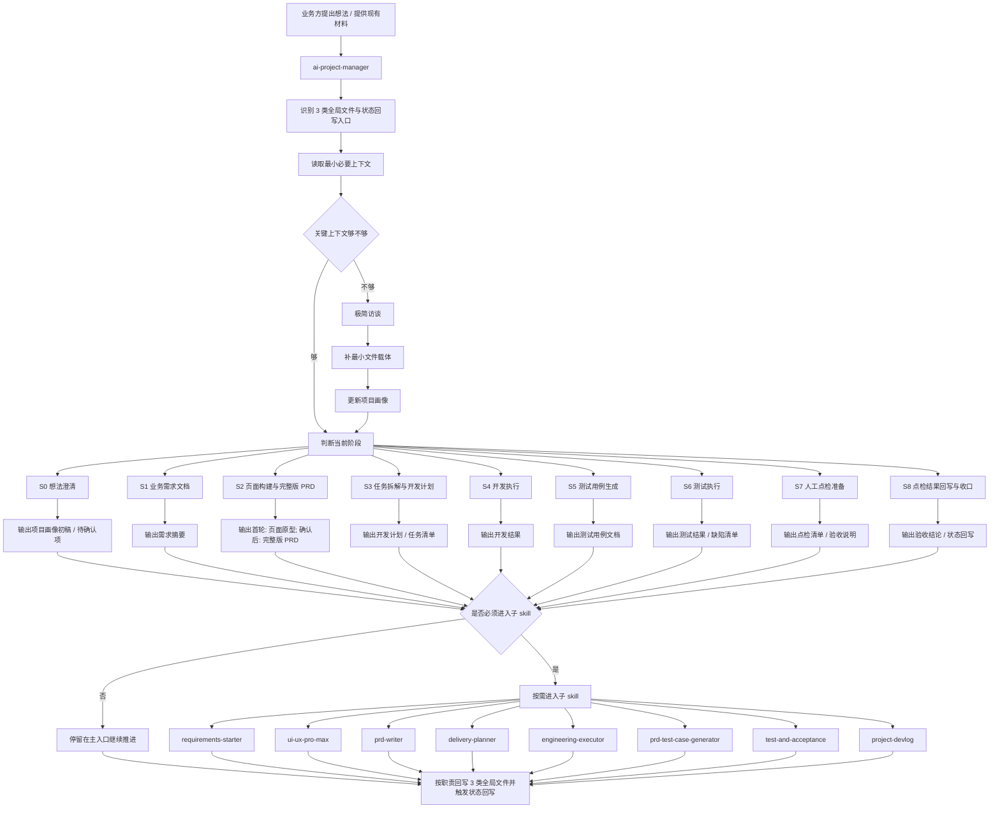

# Project Progression Workflow

## 1. 目的

本文件用于以更直观的方式说明：

- 一个项目从进入 `ai-project-manager` 开始，会如何被推进
- 全局文件、阶段判断、最小交付物、子 skill 路由之间是什么关系

这份文档偏“讲给人看”，适合用于团队讨论和对外解释。

---

## 2. 项目推进工作流图

---

## 3. 这个工作流到底在表达什么

这张图表达的不是：

- 所有项目都必须走完全部阶段
- 所有项目都必须调用所有子 skill

它真正表达的是：

1. 先识别项目骨架是否存在
2. 先补齐最小上下文
3. 先判断当前阶段
4. 先输出当前轮最小交付物
5. 只有必要时才进入子 skill
6. 最后必须回写，让下一轮能接着推进

---

## 4. 各阶段的默认最小输出物

| 阶段 | 默认最小输出物 |
|---|---|
| `S0` 需求调研 | 需求清单 / 待确认问题 |
| `S1` 业务需求文档 | 需求摘要 / 第一版范围说明 |
| `S2` 页面构建与完整版 PRD | 首轮：页面原型 / 页面代码；确认后：完整版 PRD |
| `S3` 任务拆解与开发计划 | 开发计划 / 任务清单 / 待确认项 |
| `S4` 开发执行 | 当前迭代实现 / 任务状态更新 |
| `S5` 测试用例生成 | 单域测试用例 / 验收矩阵 |
| `S6` 测试执行 | 验收结论 / 不符合项清单 |
| `S7` 人工点检准备 | 点检清单 / 验收说明 |
| `S8` 点检结果回写与收口 | 验收结论 / 阶段收口建议 / 状态回写 |

---

## 5. 为什么这张图重要

因为它把当前设计的重点讲清楚了：

- 不是先堆 skill
- 不是先展开完整方法树
- 不是先要求用户理解复杂流程

而是：

**先让项目在文件骨架上站起来，再决定下一步谁来做。**

---

## 6. 一句话结论

`project-manager-suite` 的项目推进工作流，本质上是：

**识别骨架 -> 补最小缺口 -> 判断阶段 -> 输出当前交付物 -> 必要时调用能力 -> 回写闭环。**
