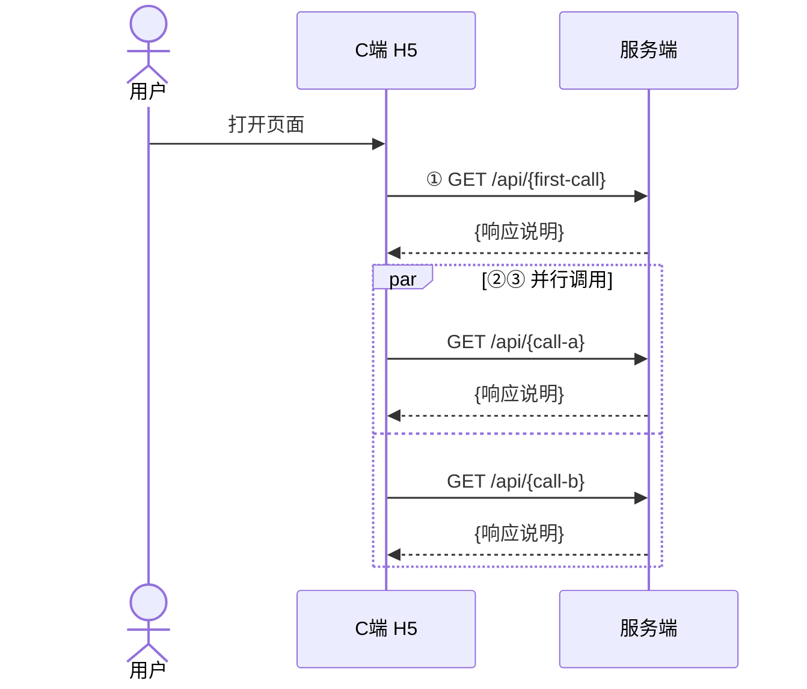

# PRD 全局应用：接口总览

<!--
  本文件是 API 接口总览文档模板。{} 中的内容为占位符，需替换为实际内容。
  <!-- 注释 --> 中的内容为写作指引，完成后删除。

  ═══════════════════════════════════════════════════════════════
  文档定位
  ═══════════════════════════════════════════════════════════════

  本文档是全系统 HTTP 接口的**唯一总览**。
  - 定义每个接口的：请求参数、响应结构、响应字段说明、计算链路、存储表
  - 子 PRD 的接口契约章节是**简化引用**，本文档是完整定义
  - 主文档附录 A 从本文档提取摘要，不做展开

  ─── 与其他文档的关系 ────────────────────────────────────────

  | 文档 | 本文档的角色 |
  |------|------------|
  | prd-主文档.md | 附录 A 引用本文档，本文档是接口权威源 |
  | prd-全局应用-database-schema.md | 本文档的「存储表」和「计算链路」引用 schema 中的表定义 |
  | prd-全局应用-术语表.md | 本文档遵循术语表定义 |
  | 各子 PRD | 子 PRD 的接口契约章节引用本文档对应小节；本文档的「影响 C 端」反向标注子 PRD 消费的字段 |

  ─── 与子 PRD 接口契约的分工 ────────────────────────────────

  本文档 = 接口契约（输入 → 输出 → 数据源映射 → 计算链路图）
  子 PRD  = 业务规则（状态怎么判定、徽章怎么计算、标签怎么匹配）

  同一个接口，本文档告诉开发者"接口长什么样"，子 PRD 告诉开发者"业务逻辑怎么算"。

  ═══════════════════════════════════════════════════════════════
  开写前必做
  ═══════════════════════════════════════════════════════════════

  Step 1：读主文档，理解系统架构、三端分工、接口全景
  Step 2：读 database-schema，掌握所有表的归属和字段
  Step 3：读所有已完成的子 PRD，梳理每个接口被哪些区块使用
  Step 4：读服务端 Controller / Service 代码，确认实际实现状态
  Step 5：按下方模板结构撰写
  Step 6：交叉验证（接口↔表↔子PRD 链路完整性）
-->

> **所属主文档**：[prd-主文档.md](prd-主文档.md)
> **文档范围**：汇总本项目全部 PRD 级别的 HTTP 接口，标注提供方、使用方、变更状态，避免各子 PRD 重复查找。
> **关联文档**：[术语表](prd-全局应用-术语表.md) · [数据库 Schema](prd-全局应用-database-schema.md)
>
> **注意**：本文档中的响应示例仅描述**业务字段**。非业务逻辑字段（如 `code`、`msg`、分页包装结构等）仅供示意，最终格式由开发阶段的统一响应规范定义。

---

## §1 全接口总览

<!--
  总览表是全文的索引，一眼看清所有接口的状态和归属。

  ─── 状态标记规则 ────────────────────────────────────────────
  - `已有`：已实现且无需变更
  - `新建`：目标态新建，当前不存在
  - `变更`：已有接口需修改（改路径/改参数/改响应/改数据源）
  - `外部`：非本系统实现，由第三方提供

  ─── 列说明 ────────────────────────────────────────────────
  - # ：序号，活跃接口从 1 开始连续编号
  - 方法：HTTP Method（GET / POST / PUT / DELETE）
  - 路径：完整 API 路径
  - 说明：一句话用途
  - 提供方：实现接口的系统（如"服务端"）
  - 使用方：调用接口的系统（如"C 端 H5"、"管理台"）
  - 状态：已有 / 新建 / 变更
  - 详见：锚点链接跳转到本文档对应章节

  ─── 分组 ────────────────────────────────────────────────
  按使用方分组：C 端接口 → 管理台配置类 → 管理台数据管理类 → 废弃接口
-->

> 约定：**提供方**指实现接口的系统，**使用方**指调用接口的系统。

### C 端接口

| # | 方法 | 路径 | 说明 | 提供方 | 使用方 | 状态 | 详见 |
|---|------|------|------|--------|--------|------|------|
| 1 | {METHOD} | `{/api/path}` | {一句话说明} | {提供方} | {使用方} | {状态} | [§N.M](#锚点) |

### 管理台接口 — 配置类

| # | 方法 | 路径 | 说明 | 提供方 | 使用方 | 状态 | 详见 |
|---|------|------|------|--------|--------|------|------|
| N | {METHOD} | `{/api/admin/path}` | {一句话说明} | {提供方} | {使用方} | {状态} | [§N.M](#锚点) |

### 管理台接口 — 数据管理类

| # | 方法 | 路径 | 说明 | 提供方 | 使用方 | 状态 | 详见 |
|---|------|------|------|--------|--------|------|------|
| N | {METHOD} | `{/api/admin/path}` | {一句话说明} | {提供方} | {使用方} | {状态} | [§N.M](#锚点) |

### 废弃接口

<!--
  废弃接口单独列表。记录原路径、废弃原因、替代方案。
  让开发者知道哪些旧接口不该再用，避免新代码调用已废弃路由。
-->

| # | 原方法 | 原路径 | 废弃原因 | 替代方案 |
|---|--------|--------|----------|----------|
| D1 | {METHOD} | `{/api/old-path}` | {原因} | {替代接口或 —} |

---

## §2 C 端接口

<!--
  ==========================================
  C 端接口撰写规范
  ==========================================

  每个接口按以下结构撰写：

  ### N.M `METHOD /api/path` — 中文名（状态后缀）

  > 状态行（必写）
  > 变更/新建说明（仅变更或新建状态写）

  请求路径 + 请求参数表
  响应字段说明表
  响应示例（标注场景条件）
  计算链路图（聚合型接口必写）
  存储表标注

  ─── 接口分类与详略 ────────────────────────────────────────

  ① 简单直透型（如 GET /api/vehicles）：
     数据从单表直透，无服务端计算。
     → 写：请求参数 + 响应字段 + 响应示例 + 数据源标注
     → 不需要计算链路图

  ② 聚合计算型（如 GET /api/basic-info）：
     服务端聚合多数据源 + 读配置表 + 实时计算。
     → 写：请求参数 + 响应字段 + 多场景响应示例 + 计算链路图
     → 计算链路图用 Mermaid flowchart，展示数据表→服务→输出的关系
     → 具体业务规则（如状态判定逻辑）不在本文档写，标注"详见 PRD X"

  ③ 外部接口（如远程视音频）：
     非本系统实现，只记录触发条件和对接状态。
     → 写：触发条件 + 接口规范说明（待对接 / 已对接）

  ─── 状态行格式 ────────────────────────────────────────────

  > 状态：**{已有/新建/变更}** | 提供方：{系统}（`{Controller}`） | 使用方：{端}

  变更状态追加：
  > **变更说明**：{简述变更内容}

  新建状态追加：
  > **新建说明**：{简述新建原因和替代的旧方案}

  变更或新建状态的接口，追加现状差异行：
  > **现状差异**：{当前实现/无此接口}。需{改动方向}

  现状差异直接写在该接口的状态块中（不等到 §7 再集中写），
  让开发者读到每个接口时就知道当前代码与目标的偏差。
  已有且无变更的接口不写现状差异。

  所有接口必须追加引用 PRD 行（写在状态块最后一行）：
  > **引用 PRD**：[{子PRD名}]({子PRD文件名}.md)

  多个 PRD 用中文顿号分隔：
  > **引用 PRD**：[prd-区块2-保养卡片区](prd-区块2-保养卡片区.md)、[prd-区块2-保养卡片区-徽章](prd-区块2-保养卡片区-徽章.md)

  ─── 引用 PRD 的作用 ────────────────────────────────────────

  建立 API 文档 → 子 PRD 的反向链接。开发者看到接口定义后，
  能一键跳转到定义该接口业务规则的子 PRD，无需手动搜索。
  与子 PRD 接口契约章节引用本文档形成**双向链接**。

  ─── 响应示例规范 ────────────────────────────────────────────

  1. 必须标注场景条件：**响应示例（{场景}）**：
  2. 聚合型接口提供多场景示例（如日常模式 + 维保中模式）
  3. JSON 中的值是样本数据，不是固定值
  4. 非业务字段（code/msg）仅供示意

  ─── 响应字段表规范 ────────────────────────────────────────────

  标准 3 列：| 字段 | 类型 | 说明 |
  变更接口加列：| 字段 | 类型 | 变更 | 说明 |
    - 新增字段：变更列填 **新增**
    - 未变字段：变更列留空

  嵌套字段用点号表示：badges[].name、popup.mainText
  可空类型写：string|null、object|null

  ─── 计算链路图规范 ────────────────────────────────────────────

  用 Mermaid flowchart LR（从左到右）。
  左侧 = 数据源表，中间 = 服务/聚合层（可选），右侧 = 配置表。
  实线箭头 = 始终读取，虚线箭头 = 条件读取（标注条件）。

  图中节点格式：[表名<br/>中文说明]
  图只展示"哪些表参与计算"，不展示"怎么计算"。
  业务规则详见对应子 PRD。

  ❌ 错误：在计算链路中写业务判定逻辑（如 if maintenanceCount >= 1）
  ✅ 正确：只画数据依赖关系，标注"详细规则见 PRD X"
-->

### 2.1 `{METHOD} /api/{path}` — {中文名}（{状态}）

> 状态：**{状态}** | 提供方：{系统}（`{Controller}`） | 使用方：{使用方}
>
> **{变更/新建}说明**：{说明内容}
>
> **现状差异**：{当前实现描述}。需{改动方向}
>
> **引用 PRD**：[{子PRD名}]({子PRD文件名}.md)

```
{METHOD} /api/{path}?{param}={value}
```

**请求参数**：

| 参数 | 类型 | 必填 | 说明 |
|------|------|------|------|
| {param} | {type} | {是/否} | {说明（含数据来源）} |

**响应字段**：

| 字段 | 类型 | 说明 |
|------|------|------|
| {field} | {type} | {说明} |

**响应示例（{场景条件}）**：

```json
{
  "code": 0,
  "msg": "success",
  "data": {}
}
```

<!--
  如果是聚合计算型接口，加计算链路图：
-->

**计算链路**：

```mermaid
flowchart LR
  A[{数据源表}<br/>{中文说明}] --> B[{配置表}<br/>{中文说明}]
```

> 数据源：`{表名}` 表

---

<!--
  按相同结构继续写 2.2、2.3... 每个 C 端接口一个小节。
-->

## §3 管理台接口 — 配置类

<!--
  ==========================================
  管理台配置类接口撰写规范
  ==========================================

  配置类接口有两种模式，根据存储表类型选择：

  ① 固定行数表（如 badge_strategy 固定 5 行）：
     GET 读 + PUT 批量覆盖保存
     → 不支持 POST 新增 / DELETE 删除
     → PUT Body 为完整数组，整体覆盖

  ② 可变行数表（如 order_benefit）：
     完整 CRUD：GET 列表 + POST 新增 + PUT/{id} 编辑 + DELETE/{id} 删除
     → GET 可带筛选参数

  ─── 状态行格式（与 C 端接口相同）────────────────────────────

  额外增加一行"影响 C 端"：
  > 影响 C 端：`GET /api/{c-端接口}` 的 {字段} 字段

  这行建立了 管理台配置 → C 端展示 的因果链：
  运营改了配置 → 下次 C 端调用即生效。

  同样必须追加引用 PRD 行（与 C 端接口规范一致）：
  > **引用 PRD**：[{子PRD名}]({子PRD文件名}.md)

  ─── 固定行数表的写法 ────────────────────────────────────────

  **获取配置**：
  ```
  GET /api/admin/{path}
  ```
  **响应示例**：（JSON）
  **批量保存**：
  ```
  PUT /api/admin/{path}
  Content-Type: application/json
  Body: {N} 条完整配置数组，整体覆盖保存
  ```
  > 存储表：`{表名}`（{N} 行固定）

  ─── 可变行数表的写法 ────────────────────────────────────────

  **获取配置**：GET + 筛选参数
  **响应字段表** + **响应示例**
  **新增**：POST
  **编辑**：PUT /{id}
  **删除**：DELETE /{id}
  > 存储表：`{表名}`（可变行数）

  ─── 通用约定（写在 §3 开头）────────────────────────────────

  > 通用约定：
  > - 所有配置类接口遵循 GET 读 + PUT 写模式（固定行数表）或 CRUD 模式（可变行数表）
  > - 配置即时生效：PUT 成功后，下次 C 端调用即读到新值
-->

> 通用约定：
> - 所有配置类接口遵循 `GET` 读 + `PUT` 写模式（固定行数表）或 `CRUD` 模式（可变行数表）
> - 配置即时生效：PUT 成功后，下次 C 端调用 `basic-info` / `orders` 即读到新值

### 3.1 `GET/PUT /api/admin/{path}` — {中文名}（{状态}）

> 状态：**{状态}** | 提供方：{系统}（`{Controller}`） | 使用方：管理台（{页面名} 页面）
>
> 影响 C 端：`GET /api/{c-端接口}` 的 {字段} 字段
>
> **现状差异**：{当前实现描述}。需{改动方向}
>
> **引用 PRD**：[{子PRD名}]({子PRD文件名}.md)

**获取配置**：

```
GET /api/admin/{path}
```

**响应示例**：

```json
{
  "code": 0,
  "data": []
}
```

**批量保存**：

```
PUT /api/admin/{path}
Content-Type: application/json
Body: {N} 条完整配置数组，整体覆盖保存
```

> 存储表：`{表名}`（{N} 行固定）

---

## §4 管理台接口 — 数据管理类

<!--
  数据管理类接口与配置类的区别：
  - 配置类：运营手动维护配置 → 影响 C 端展示
  - 数据管理类：查看/管理业务数据（如查用户保养状态、查同步日志、触发同步）

  数据管理类接口通常是只读的（GET），少数有操作类（POST 触发同步）。
  不需要写"影响 C 端"行，因为这些接口不直接影响 C 端展示。

  如果某个管理台接口复用了 C 端 Service（如 vehicle-detail 复用 BasicInfoService），
  需要在状态行标注"复用 {Service}"，并在响应说明中标注与 C 端接口的区别。

  同样必须追加引用 PRD 行（与 C 端接口规范一致）：
  > **引用 PRD**：[{子PRD名}]({子PRD文件名}.md)
-->

### 4.1 `{METHOD} /api/admin/{path}` — {中文名}（{状态}）

> 状态：**{状态}** | 提供方：{系统}（`{Controller}`） | 使用方：管理台（{页面名} 页面）
>
> **现状差异**：{当前实现描述}。需{改动方向}
>
> **引用 PRD**：[{子PRD名}]({子PRD文件名}.md)

```
{METHOD} /api/admin/{path}?{params}
```

**请求参数**：

| 参数 | 类型 | 必填 | 说明 |
|------|------|------|------|
| {param} | {type} | {是/否} | {说明} |

**响应字段**：

| 字段 | 类型 | 说明 |
|------|------|------|
| {field} | {type} | {说明} |

**响应示例**：

```json
{
  "code": 0,
  "data": {}
}
```

> 数据源：`{表名}` 表

---

## §5 接口与数据表映射

<!--
  ==========================================
  接口↔数据表 快速索引
  ==========================================

  本节是纯索引，不做展开说明。目的：
  1. 开发者修改表结构时，快速查看影响哪些接口
  2. AI 实现接口时，快速确认需要读写哪些表
  3. 与 database-schema 文档的「使用接口」形成双向索引

  ─── 格式 ────────────────────────────────────────────────

  按使用方分两张表：C 端接口 / 管理台接口

  | 接口 | 读取表 | 写入表 |
  |------|--------|--------|
  | `GET /api/xxx` | `table_a`, `table_b` | — |

  - C 端接口通常只读不写（写入表为 —）
  - 管理台配置接口读写同一张表
  - 同步触发接口写入多张表

  ─── 与 database-schema 的交叉验证 ────────────────────────

  本节的每张表必须在 database-schema 中有定义。
  database-schema 中每张表的「使用接口」必须在本节能找到对应行。
  两处不一致 = 文档有误，必须修正。
-->

> 快速索引：接口读写哪些表。

### C 端接口 → 数据表

| 接口 | 读取表 | 写入表 |
|------|--------|--------|
| `{METHOD} /api/{path}` | `{table_a}`, `{table_b}` | — |

### 管理台接口 → 数据表

| 接口 | 读取表 | 写入表 |
|------|--------|--------|
| `/api/admin/{path}` | `{table}` | `{table}` |

---

## §6 调用时序

<!--
  ==========================================
  调用时序图撰写规范
  ==========================================

  用 Mermaid sequenceDiagram 展示 C 端页面的完整调用流程。

  ─── 参与者 ────────────────────────────────────────────────

  actor 用户
  participant H5 as C端 H5
  participant 服务端
  participant {外部系统}（如有）

  ─── 语法要点 ────────────────────────────────────────────────

  - par ... and ... end：并行调用（如 basic-info + orders/types + orders 同时发出）
  - opt {条件}：条件执行（如 hasRemoteVideo = true 时才调远程视音频）
  - alt {条件A} ... else {条件B} ... end：分支（如切换 Tab vs 滚动加载 vs 切换车辆）
  - Note over A,B: {说明}：跨参与者注释

  ─── 编号约定 ────────────────────────────────────────────────

  用圈数字标注调用顺序：①②③④⑤
  同一个 par 块内的调用共用同一组编号（如 ②③）

  ─── 覆盖范围 ────────────────────────────────────────────────

  时序图覆盖用户从打开页面到所有交互分支的完整流程。
  只画 C 端调用链，不画管理台调用链（管理台是独立的 CRUD 操作）。
-->



---

## §7 现状差异

<!--
  ==========================================
  现状差异 — 快速索引
  ==========================================

  §7 是**快速索引**，不是完整差异分析。
  各接口的详细现状差异已内联标注在 §2–§4 各节的 `> **现状差异**：` 引用块中。

  ─── 为什么用内联 + 索引模式 ────────────────────────────────

  1. 开发者读到每个接口时，就地看到现状偏差，无需跳转到 §7
  2. §7 保留为汇总索引，方便整体评估改造工作量
  3. 避免信息在两处维护导致不一致

  ─── 格式 ────────────────────────────────────────────────

  | 接口 | 状态 | 差异摘要 |

  - 接口：接口路径
  - 状态：新建 / 变更（已有且无变更的不列）
  - 差异摘要：一句话概括（详细内容见各接口的内联标注）

  ─── 哪些接口需要列出 ────────────────────────────────────────

  - 所有状态为「新建」或「变更」的接口
  - 同步服务等虽非接口但有改造工作的项
  - 状态为「已有」且无变更的接口不需要列出

  ─── 注意事项 ────────────────────────────────────────────────

  不包含纯开发细节（如代码风格、框架选择）。
  只描述产品/接口层面的差异。
-->

> 各接口的现状差异已内联标注在 §2–§4 各节的 **现状差异** 引用块中。以下为快速索引。

| 接口 | 状态 | 差异摘要 |
|------|------|----------|
| `{/api/path}` | {新建/变更} | {一句话摘要，详见 §N.M} |
